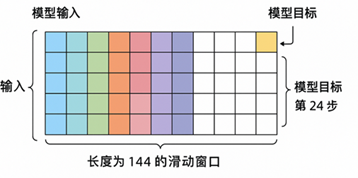
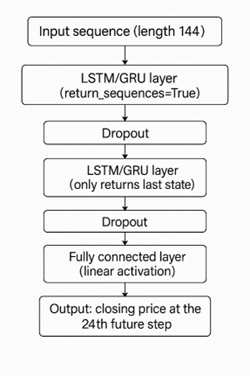
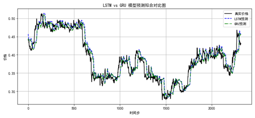
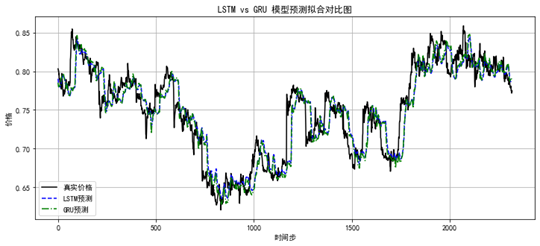
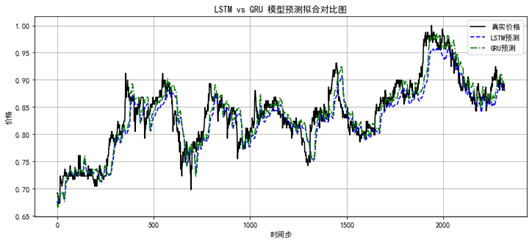
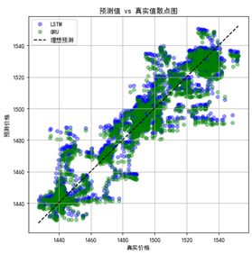
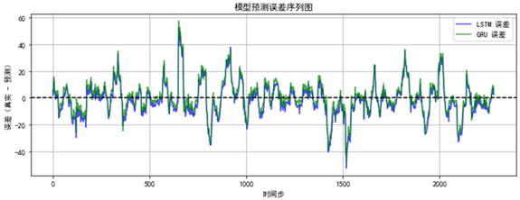
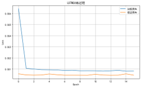
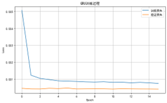

# Stock Price Prediction using LSTM & GRU

##  Overview

This project explores time-series prediction for stock prices using deep learning models (LSTM and GRU).

The focus is not on building a full trading system, but on:

- Mid-to-high-frequency (5-minute) stock data modeling
- Sequence learning using sliding windows
- Model comparison (LSTM vs GRU)
- Evaluating both prediction accuracy and trading performance

---

##  Dataset

- Market: Chinese A-share market
- Frequency: 5-minute K-line data
- Stocks:
  - 600519 (Kweichow Moutai)
  - 300750 (CATL)
  - 601988 (Bank of China)

Features used:
- Close price
- Volume
- Open / High / Low

---

##  Methodology

### Data Processing
- Sliding window: 144 timesteps
- Prediction horizon: 24 steps ahead (~2 hours)
- MinMax normalization
- Time-based train/test split (no data leakage)

### Models
- 2-layer LSTM
- 2-layer GRU
- Dropout for regularization
- EarlyStopping + ModelCheckpoint

### Hyperparameter Tuning
- Units: 64 / 128
- Dropout: 0.2 / 0.3
- Optimizer: Adam / RMSprop

---
## 🧠 Method Overview

### Sliding Window Design

### Model Architecture

##  Evaluation

### Metrics
- MAE
- RMSE
- MAPE
- R²
- Directional accuracy

### Trading Strategy
A simple strategy is applied:

- If predicted price > current → Buy
- If predicted price < current → Sell

Metrics:
- Total profit
- Profit per trade
- Direction prediction accuracy

---

##  Key Results

- Direction accuracy: ~52% - 56%
- GRU: lower prediction error
- LSTM: slightly better trading profit

---
## 📊 Results Visualization

### 📈 Prediction Comparison (LSTM vs GRU)

#### 600519 (Kweichow Moutai)

#### 300750 (CATL)

#### 601988 (Bank of China)

---

### 🔍 Detailed Analysis (600519)

#### Prediction Scatter Plot

#### Error Series

---

### 📉 Training Process

#### LSTM Training Loss

#### GRU Training Loss

##  Limitations

- No transaction costs considered
- Limited feature set
- Small number of stocks

---

##  Future Work

- Build Streamlit web interface
- Add technical indicators
- Improve feature engineering

---

##  Tech Stack

- Python
- TensorFlow / Keras
- Pandas / NumPy
- Matplotlib
